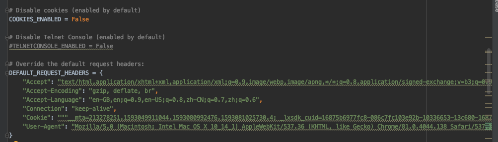
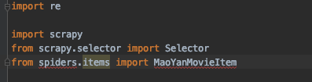
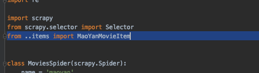

学习笔记

> 组里有个同学很猛，晚上不睡觉，写爬虫。
> <br> 向他学习！

# 遇到的问题及解决
## 1. Scrapy cookie的设置
- 首先将 COOKIES_ENABLED = False 取消注释
- 然后在 DEFAULT_REQUEST_HEADERS 中加上需要使用的 Cookie <br>


## 2. 导包出错
直接使用下面导入语句IDE会提示错误<br>
```python
from spiders.items import MaoYanMovieItem
```
如下图<br>

<br>
最后换成下面语句就好了<br>
```python
from ..item import MaoYanMovieItem
```
如下图<br>

