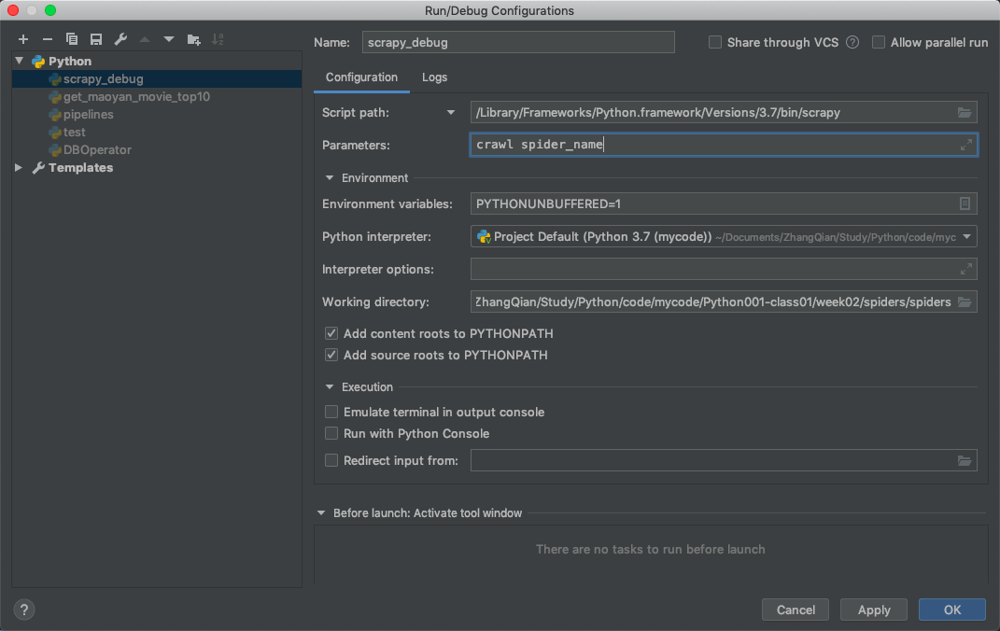

学习笔记

- 同一目录下Python导入其他模块失败
    - 将文件夹 Mark Directory as Resource Root
- 同一目录下导入其他模块启动scrapy时报错找不到模块
    - from spiders.xxx import xxx
- 配置scrapy run configuration
    我们运行爬虫时是这样:
    ```shell script
    scrapy crawl spider_name
    ```
    1. 命令行执行下面命令查看scrapy命令的位置
    ```shell script
    which scrapy
    ```
    2. 将第一步中的结果配置到run configuration 的Script path中，parameters 配置自己爬虫的名字，如下图：
    
