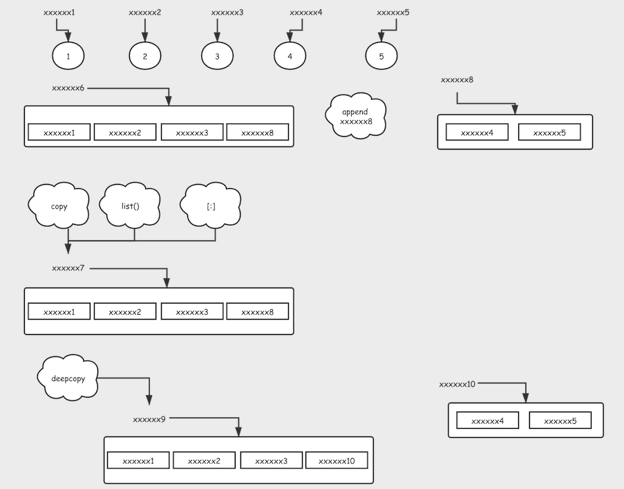

# 对深拷贝和浅拷贝的理解


比如我们现在在内存中申请了一块内存，地址是*xxxxxx6*，里面的内容是: **[1, 2, 3, [4, 5]]**

又比如我们现在定义了一个名为*old_list*变量，我们让它指向*xxxxxx6*，如上图，它的**id(old_list) = xxxxxx6**

上面整个步骤，在我们的python中其实就是：

```Python
old_list = [1, 2, 3]
old_list.append([4, 5])
或者直接定义
old_list = [1, 2, 3, [4, 5]]
```

> 其实就是id(old_list) = xxxxxx6，让它指向了这个地址

现在我们在Python中进行最最肤浅的引用传递：

```Python
new_list1 = old_list
```

> 其实就相当于让id(new_list1) = xxxxxx6

然后我们进行一些浅拷贝：

```Python
new_list2 = list(old_list)
new_list3 = old_list[:]
new_list4 = copy.copy(old_list)
```

> 其实呢就相当于把 xxxxxx6 对应的内存里的内容也就是（地址数据）拷贝了一份到了 xxxxxx7，由于它仅仅是肤浅的拷贝，并没有察觉里面的内容到底指向的不可变的数据还是另一个容器，也就是说，最后那个列表元素[4, 5]的地址拷贝出去的两份都指向的是同一个地址xxxxxx8

最后深拷贝：

```Python
new_list5 = copy.deepcopy(old_list)
```

> 确保了每个不可变数据地址都被拷贝了一份

# 背熟作用域：LEGB
不知道作用域是啥的时候就念下口诀：LEGB 去吧皮卡丘！
