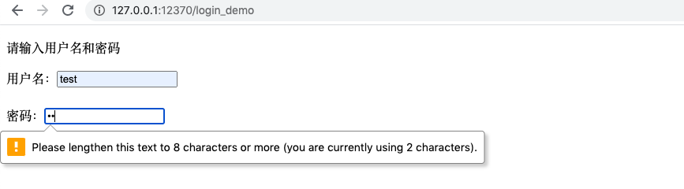

[toc]

# 学习 Python 源码的步骤

## 套路在此

1. 查文档，了解其定义
2. 看实现，并自己手撸一遍
3. 写使用 demo
4. 记下一些使用心得

## 现炒现卖来分析一下functools.reduce(function, iterable[, initializer])
1. 定义
> 将两个参数的 function 从左至右累积地应用到 sequence 的条目，以便将该序列缩减为单一值。例如，reduce(lambda x, y: x+y, [1, 2, 3, 4, 5]) 是计算 ((((1+2)+3)+4)+5) 的值。 左边的参数 x 是累积值而右边的参数 y 则是来自 sequence 的更新值。 如果存在可选项 initializer，它会被放在参与计算的序列的条目之前，并在序列对象为空时作为默认值。 如果没有给出 initializer 并且 sequence 仅包含一个条目，则将返回第一项。

2. 看实现，手撸如下：
```Python
def fake_reduce(function, iterable, initializer=None):
    # 先将 iterable 强制转换成迭代器
    it = iter(iterable)
    # 判断是否有初始值
    if initializer:
        value = initializer
    else:
        value = next(it)
    # 将参数逐一应用到 function
    for element in it:
        value = function(value, element)
    # 返回 计算结果
    return value
```

3. 使用 demo
```Python
print(functools.reduce(lambda x, y: x * y, [1, 3, 3, 7, 9], 5))
# 2835
```


# homework -- 实操步骤


1. 使用命令创建Django项目

   ```shell
   django-admin startproject user_login
   ```

2. 使用命令创建Django应用

   ```Shell
   python manage.py startapp user_login_demo
   ```

3. 修改配置settings.py
  - 将自己的应用追加到末尾
  - 修改数据库配置
  

4. 在项目的路由文件urls.py中添加自己应用要使用的路由文件路径
  

5. 准备要使用的用户名密码
  - 在数据库中创建要使用到的表,通过下面命令自动创建Django默认使用的用户表
  ```shell
  python manage.py migrate
  ```
  - 创建Django管理员用户
  ```Shell
  python manage.py createsuperuser
  ```
  - 进入Django交互环境，创建等下使用来登录的用户
  ```shell
  python manage.py shell
  from django.contrib.auth.models import User
  user = User.objects.create_user('test', 'test@test.com', 'testpasswd')
  ```

6. 创建登录页面的表单
```python
from django import forms
class LoginForm(forms.Form):
    user_name = forms.CharField(label="用户名")
    passwd = forms.CharField(widget=forms.PasswordInput, min_length=8, label="密码")
```

7. 编写视图函数
```python
from django.contrib.auth import authenticate, login
from django.shortcuts import render
from .form import LoginForm
def login_demo(request):
    if request.method == 'POST':
        login_form = LoginForm(request.POST)
        if login_form.is_valid():
            cd = login_form.cleaned_data
            user = authenticate(username=cd['user_name'], password=cd['passwd'])
            if user:
                login(request, user)
                return render(request, 'success.html')
            else:
                return render(request, 'fail.html', {'form': login_form})
    if request.method == "GET":
        login_form = LoginForm()
        return render(request, 'login.html', {'form': login_form})
```

8. 在自己应用的文件夹下添加步骤4中指定的路由文件
```Python
from django.urls import path
from . import views
urlpatterns = [
    path('', views.login_demo)
]
```

9. 在自己应用下创建templates文件夹并在文件夹下准备视图函数中使用到的模板文件
```html
# login.html
<!DOCTYPE html>
<html lang="en">
<head>
    <meta charset="UTF-8">
    <title>Login</title>
</head>
<body>
<p>请输入用户名和密码</p>
<form action="/login_demo" method="post">
    
    <div>用户名：{{ form.user_name }}</div>
    <br>
    <div>密码：{{ form.passwd }}</div>
    <br>
    <input type="submit" value="登录">
</form>
</body>
</html>
```
```html
# success.html
<!DOCTYPE html>
<html lang="en">
<head>
    <meta charset="UTF-8">
    <title>Welcome</title>
</head>
<body>
    <p>恭喜你完成登录试炼！</p>
</body>
</html>
```
```html
# fail.html
<!DOCTYPE html>
<html lang="en">
<head>
    <meta charset="UTF-8">
    <title>Login</title>
</head>
<body>
<p>登录失败，请输入正确的用户名和密码！</p>
<form action="/login_demo" method="post">
    
    <div>用户名：{{ form.user_name }}</div>
    <br>
    <div>密码：{{ form.passwd }}</div>
    <br>
    <input type="submit" value="登录">
</form>
</body>
</html>
```

10. 运行看结果
```Shell
python manage.py runserver 0.0.0.0:12370
```
登录首页

长度小于8的验证

登录失败

登录成功

