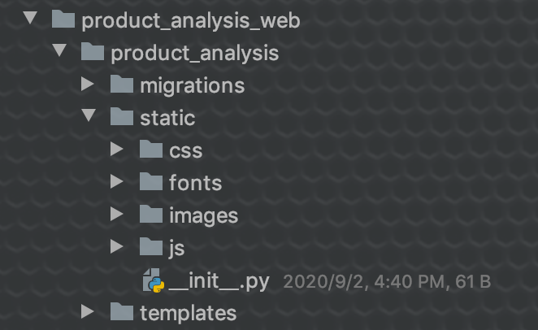

[toc]

# 食谱： 爬虫 + 展示 系统

## 步骤一：爬虫

### 使用scrapy爬取数据

##### 1. 创建爬虫项目：

```Shell
scrapy startproject product_analysis
```

#####2. 创建爬虫

```Shell
scrapy genspider smzdm smzdm.com
```

#####3. 修改Settings

```Python
# settings.py
# Obey robots.txt rules
ROBOTSTXT_OBEY = False
# Configure a delay for requests for the same website (default: 0)
DOWNLOAD_DELAY = 1
# Override the default request headers:
DEFAULT_REQUEST_HEADERS = {
    "Accept": "text/html,application/xhtml+xml,application/xml;q=0.9,image/webp,image/apng,*/*;q=0.8,application/signed-exchange;v=b3;q=0.9",
    "Accept-Encoding": "gzip, deflate, br",
    "Accept-Language": "en-GB,en;q=0.9,en-US;q=0.8,zh-CN;q=0.7,zh;q=0.6",
    "Connection": "keep-alive",
    "Cookie": """__mta=213278251.1593049911044.1593080992476.1593081025730.4; _lxsdk_cuid=16875b6977fc8-086c7fc103e92b-10336653-13c680-16875b697803d; uuid_n_v=v1; uuid=6E0CD8B0B68611EA909D9FF2C00A78C340B6EBDA9F494CD8BB5F998EE90EA231; _csrf=0f3467195309731aed35390fb3c08afc4cbd26d1307822a8b3bcec889fb88a78; mojo-uuid=6a4490e41a669a78f6e37fc37c9166ca; _lxsdk=6E0CD8B0B68611EA909D9FF2C00A78C340B6EBDA9F494CD8BB5F998EE90EA231; mojo-session-id={"id":"53eeb8c5c0172ad163a9ed73233a4adf","time":1593182087825}; Hm_lvt_703e94591e87be68cc8da0da7cbd0be2=1593049911,1593078172,1593078195,1593182088; mojo-trace-id=3; Hm_lpvt_703e94591e87be68cc8da0da7cbd0be2=1593183312; __mta=213278251.1593049911044.1593081025730.1593183311744.5; _lxsdk_s=172f10d65f9-536-ea4-dc3%7C%7C6""",
    "User-Agent": "Mozilla/5.0 (Windows NT 6.1) AppleWebKit/536.3 (KHTML, like Gecko) Chrome/19.0.1061.1 Safari/536.3"
}
# Configure item pipelines
ITEM_PIPELINES = {
   'product_analysis.pipelines.ProductAnalysisPipeline': 300,
}
# Set logger
LOG_ENABLE = True
LOG_LEVEL = 'DEBUG'
LOG_FILE = './smzdm.log'
# Configure DB
MYSQL_HOST = '127.0.0.1'
MYSQL_PORT = 3306
MYSQL_USERNAME = 'root'
MYSQL_PASSWORD = 'MySQL666!'
MYSQL_DB = 'db1'
```

#####4. 定义想要爬取的字段

```Python
# items.py
import scrapy
class ProductAnalysisItem(scrapy.Item):
    # define the fields for your item here like:
    # name = scrapy.Field()
    product_name = scrapy.Field()
    user_name = scrapy.Field()
    user_comment = scrapy.Field()
```

#####5. 创建数据表

```mysql
CREATE TABLE product
 (
 id BIGINT(20) PRIMARY KEY NOT NULL AUTO_INCREMENT,
 product_name VARCHAR(128) COMMENT '商品名',
 user_name VARCHAR(128) COMMENT '用户名',
 user_comment VARCHAR(768) COMMENT '用户评论',
 create_time DATETIME COMMENT '入库时间'
 ) DEFAULT CHARSET=utf8mb4;
```

#####6. 定义数据存储逻辑

```Python
# pipelines.py
# -*- coding: utf-8 -*-
# Define your item pipelines here
#
# Don't forget to add your pipeline to the ITEM_PIPELINES setting
# See: https://docs.scrapy.org/en/latest/topics/item-pipeline.html
from datetime import datetime
import pymysql
import logging
class ProductAnalysisPipeline:
    data_list = []
    def __init__(self, host, port, user, password, db):
        self.host = host
        self.port = port
        self.user = user
        self.password = password
        self.db = db

    @classmethod
    def from_crawler(cls, crawler):
        return cls(
            host=crawler.settings.get('MYSQL_HOST'),
            port=crawler.settings.get('MYSQL_PORT'),
            user=crawler.settings.get('MYSQL_USERNAME'),
            password=crawler.settings.get('MYSQL_PASSWORD'),
            db=crawler.settings.get('MYSQL_DB')
        )
    def open_spider(self, spider):
        self.conn = pymysql.connect(host=self.host,
                                    port=self.port,
                                    user=self.user,
                                    password=self.password,
                                    db=self.db,
                                    charset='utf8mb4')
        self.cur = self.conn.cursor()
        logging.info(f"Connected to mysql: {self.conn.host} on port: {self.conn.port}, using db: {self.conn.db}, "
                     f"charset is: {self.conn.charset}")
    def close_spider(self, spider):
        self.insert_data(self.data_list)
        self.cur.close()
        self.conn.close()
        logging.info("DB connection closed.")
    def process_item(self, item, spider):
        if len(self.data_list) == 10:
            self.insert_data(self.data_list)
            self.data_list = []
        else:
            product_name = item['product_name']
            user_name = item['user_name']
            user_comment = item['user_comment']
            create_time = datetime.now().strftime("%Y-%m-%d %H:%M:%S")
            self.data_list.append([product_name, user_name, user_comment, create_time])
        return item
    def insert_data(self, data_list):
        logging.debug(f"Will insert following data: {data_list}")
        try:
            sql = """
            INSERT INTO product(product_name, user_name, user_comment, create_time)
            VALUES (%s, %s, %s, %s)"""
            self.cur.executemany(sql, data_list)
            self.conn.commit()
            logging.info(f"Inserted {len(data_list)} comments to DB.")
        except Exception as e:
            self.conn.rollback()
            logging.error("Insertion fail!")
            logging.error(e)
if __name__ == '__main__':
    data_list = [['怡泉 Schweppes 无糖零卡 苏打水 汽水饮料400ml*12瓶 整箱装 可口可乐公司出品+凑单品', '值友3032196445', '我也是😭！！！！ ', '2020-08-30 21:12:50']]
    conn = pymysql.connect(host='127.0.0.1',
                           port=3306,
                           user='root',
                           password='MySQL666!',
                           db='db1')
    cur = conn.cursor()
    for data in data_list:
        product_name, user_name, user_comment, create_time = data
        sql = f"""
                        INSERT INTO product(product_name, user_name, user_comment, create_time)
                        VALUES ('{product_name}', '{user_name}', '{user_comment}', '{create_time}')
                        ON DUPLICATE KEY UPDATE create_time = '{create_time}'"""
        cur.execute(sql)
    cur.close()
    conn.commit()
    conn.close()
```

#####7. 写爬取逻辑：

```Python
# smzdm.py
# -*- coding: utf-8 -*-
import scrapy
from ..items import ProductAnalysisItem
class SmzdmSpider(scrapy.Spider):
    name = 'smzdm'
    allowed_domains = ['smzdm.com']
    start_urls = ['https://www.smzdm.com/fenlei/qipaoshui/']

    def start_requests(self):
        yield scrapy.Request(self.start_urls[0], callback=self.parse_ten)

    def parse_ten(self, response):
        products = response.xpath(
            '//*[@class="feed-row-wide"]'
        )[:10]
        for product in products:
            item = ProductAnalysisItem()
            product_name = product.xpath(
                './/h5[@class="feed-block-title"]/a/text()'
            ).extract_first()
            self.logger.debug(f"current product name is: {product_name}")
            item['product_name'] = product_name.strip()
            url = product.xpath(
                './/h5[@class="feed-block-title"]/a/@href'
            ).extract_first()
            self.logger.info(f"first ten product url: {url}")
            yield scrapy.Request(url, meta={'item': item}, callback=self.parse_details)
    def parse_details(self, response):
        item = response.meta['item']
        comments = response.xpath(
            '//*[@id="commentTabBlockNew"]/ul[@class="comment_listBox"]/li[@class="comment_list"]'
        )
        self.logger.info(f"{len(comments)} comments on current page")
        for comment in comments:
            user_name = comment.xpath(
                './div[@class="comment_conBox"]/div[@class="comment_avatar_time "]/a/span/text()'
            ).extract_first()
            user_comment = "".join(comment.xpath(
                './div[@class="comment_conBox"]/div[@class="comment_conWrap"]/div/p/span/text()'
            ).extract())
            self.logger.debug(f"-----------------{user_name} said: {user_comment}-----------------")
            item['user_name'] = user_name.strip()
            item['user_comment'] = user_comment.strip()
            yield item
        next_page = response.xpath(
            '//*[@id="commentTabBlockNew"]/ul[@class="pagination"]/li[@class="pagedown"]/a/@href'
        ).extract_first()
        if next_page:
            self.logger.info(f"next page url is: {next_page}")
            yield scrapy.Request(next_page, meta={'item': item}, callback=self.parse_details)
```

#####8. 创建运行爬虫的脚本

```sh
#! /bin/sh
# cron_smzdm.sh
source /etc/profile
cd /Users/kernel/Python/mycode/Python001-class01/venv/bin/
source activate
cd /Users/kernel/Python/mycode/Python001-class01/week10/product_analysis
PATH=$PATH:/usr/local/bin
export PATH
scrapy crawl smzdm
python3.7 product_data_clean.py
```

#####9. 创建定时任务

```Shell
# cron.scrapy
# 每小时的第一分钟运行
1 * * * *  sh /Users/kernel/Python/mycode/Python001-class01/week10/product_analysis/cron_smzdm.sh  >/tmp/cron.out 2>/tmp/cronerr.out
```
```Shell
# 提交文件中的定时任务
crontab cron.scrapy
# 直接在定时任务列表中添加上面定时任务
crontab -e
1 * * * *  sh /Users/kernel/Python/mycode/Python001-class01/week10/product_analysis/cron_smzdm.sh  >/tmp/cron.out 2>/tmp/cronerr.out
# 显示当前定时任务列表
crontab -l
```


## 步骤二：展示

### 使用Django展示步骤一中保存到数据库的数据

#####1. 创建Django项目

```Shell
django-admin startproject product_analysis_web
```

#####2. 创建展示app

```Shell
django-admin startapp product_analysis
```

#####3. 修改配置文件

```Python
# settings.py
# Application definition
INSTALLED_APPS = [
    'django.contrib.admin',
    'django.contrib.auth',
    'django.contrib.contenttypes',
    'django.contrib.sessions',
    'django.contrib.messages',
    'django.contrib.staticfiles',
    'product_analysis',
]
# Database
DATABASES = {
    'default': {
        'ENGINE': 'django.db.backends.mysql',
        'NAME': 'db1',
        'USER': 'root',
        'PASSWORD': 'MySQL666!',
        'HOST': '127.0.0.1',
        'PORT': '3306',
    }
}
# Static files (CSS, JavaScript, Images)
STATIC_URL = '/static/'
```

#####4. 修改主程序的路由逻辑

```Python
# urls.py
urlpatterns = [
    path('admin/', admin.site.urls),
    path('', include('product_analysis.urls'))
]
```

#####5. 修改具体app中的路由逻辑

```Python
# product_analysis/urls.py

from django.urls import path

from . import views

urlpatterns = [
    path('', views.qipaoshui),
    path('index', views.qipaoshui),
    path('qipaoshui', views.qipaoshui)
]
```

#####6. 添加数据模型文件（M）

```Shell
# 查看数据库中已经存在模型
python manage.py inspectdb
```

```Python
# product_analysis/models.py
# 将上一命令中，生成的内容中需要的模型，拷贝到此文件中
from django.db import models
class ProductCleaned(models.Model):
    id = models.BigIntegerField(primary_key=True)
    product_name = models.TextField(blank=True, null=True)
    user_name = models.TextField(blank=True, null=True)
    user_comment = models.TextField(blank=True, null=True)
    create_time = models.DateTimeField(blank=True, null=True)
    sentiment = models.FloatField(blank=True, null=True)
 class Meta:
        managed = False
        db_table = 'product_cleaned'
```

#####7. 使用一把梭的方式拷贝templates和static中的文件到app目录product_analysis下（T）

目录结构如下：


[上面文件地址](https://github.com/qilaidi/Python001-class01/tree/master/week06/douban/douban_movie)

#####8. 准备模板中使用的数据

```Python
# views.py
from django.db.models import Avg
from django.shortcuts import render
# Create your views here.
from .models import ProductCleaned
def qipaoshui(request):
    ## 取出数据库内容
    contents = ProductCleaned.objects.all()
    ## 评论数量
    counter = len(contents)
    ## 情感倾向
    sent_avg = f"{contents.aggregate(Avg('sentiment'))['sentiment__avg']:0.1f}"
    ## 正向数量
    plus = contents.filter(sentiment__gte=0.5).count()
    ## 负向数量
    minus = contents.filter(sentiment__lt=0.5).count()
    page_name = '气泡水'
    return render(request, 'result.html', locals())
```

#####9. 修改模板，显示上面数据到页面

```html
<!--base_layout.html-->
<!DOCTYPE html>
<html>
<head>
    
    <meta charset="utf-8">
    <meta http-equiv="X-UA-Compatible" content="IE=edge">
    <meta name="viewport" content="width=device-width, initial-scale=1">
    <meta name="description" content="">
    <meta name="author" content="Allenh">
    <title> - 到底什么值得买</title>
    
    <link rel="stylesheet" href="">
    <link rel="stylesheet" href="">
    <link rel="stylesheet" href="">
    <link rel="stylesheet" href="">
    <![endif]-->
    
</head>
<body>
     
    
    <script src=""></script>
    <script src=""></script>
    <!-- <script src=""></script>
    <script src=""></script> -->
    
</body>
</html>
```

```html
<!--result.html-->
 欢迎


    {{ block.super }}
    <link rel="stylesheet" href="">
    <link rel="stylesheet" href="">


<div class="row">
    <div class="col-lg-12">
        <h1 class="page-header">{{ page_name }}</h1>
    </div>
    <!-- /.col-lg-12 -->
</div>
<!-- /.row -->
<div class="row">
    <div class="col-lg-3 col-md-6">
        <div class="panel panel-primary">
            <div class="panel-heading">
                <div class="row">
                    <div class="col-xs-3">
                        <i class="fa fa-comments fa-5x"></i>
                    </div>
                    <div class="col-xs-9 text-right">
                        <div class="huge">{{ counter }}</div>
                        <div>评论数量</div>
                    </div>
                </div>
            </div>
        </div>
    </div>
    <div class="col-lg-3 col-md-6">
        <div class="panel panel-yellow">
            <div class="panel-heading">
                <div class="row">
                    <div class="col-xs-3">
                        <i class="fa fa-shopping-cart fa-5x"></i>
                    </div>
                    <div class="col-xs-9 text-right">
                        <div class="huge">{{ sent_avg }}</div>
                        <div>情感倾向</div>
                    </div>
                </div>
            </div>
        </div>
    </div>
    <div class="col-lg-3 col-md-6">
        <div class="panel panel-red">
            <div class="panel-heading">
                <div class="row">
                    <div class="col-xs-3">
                        <i class="fa fa-thumbs-up fa-5x"></i>
                    </div>
                    <div class="col-xs-9 text-right">
                        <div class="huge">{{ plus }}</div>
                        <div>正向数量</div>
                    </div>
                </div>
            </div>
        </div>
    </div>
    <div class="col-lg-3 col-md-6">
        <div class="panel panel-green">
            <div class="panel-heading">
                <div class="row">
                    <div class="col-xs-3">
                        <i class="fa fa-thumbs-down fa-5x"></i>
                    </div>
                    <div class="col-xs-9 text-right">
                        <div class="huge">{{ minus }}</div>
                        <div>负向数量</div>
                    </div>
                </div>
            </div>
        </div>
    </div>
</div>
<!-- /.row -->
<div class="row">
    <div class="col-lg-8">

        <div class="panel panel-default">
            <div class="panel-heading">
                <i class="fa fa-bar-chart-o fa-fw"></i> 舆情数据展示
            </div>
            <!-- /.panel-heading -->
            <div class="panel-body">
                <div class="row">
                    <div class="col-lg-12">
                        <div class="table-responsive">
                            <table class="table table-bordered table-hover table-striped" id="dataTables-details">
                                <thead>
                                    <tr>
                                        <th>商品名</th>
                                        <th>用户名</th>
                                        <th>评论</th>
                                        <th>情感倾向</th>
                                        <th>记录时间</th>
                                    </tr>
                                </thead>
                                <tbody>
                                    
                                        <tr>
                                            <td>{{content.product_name}}</td>
                                            <td>{{content.user_name}}</td>
                                            <td>{{content.user_comment}}</td>
                                            <td>{{content.sentiment|floatformat:2}}</td>
                                            <td width="17%">{{content.create_time|date:"Y-m-d H:i:s"}}</td>
                                        </tr>
                                    
                                </tbody>
                            </table>
                        </div>
                        <!-- /.table-responsive -->
                    </div>
                    <!-- /.col-lg-4 (nested) -->
                </div>
                <!-- /.row -->
            </div>
            <!-- /.panel-body -->
        </div>
        <!-- /.panel -->

    </div>

    <!-- /.col-lg-8 -->
    <div class="col-lg-4">
        <div>
            <div id="lg05" style="display: none">{{ plus }}</div>
            <div id="lt05" style="display: none">{{ minus }}</div>
        </div>
        <div class="panel panel-default">
            <div class="panel-heading">
                <i class="fa fa-bar-chart-o fa-fw"></i> 情感倾向
            </div>
            <div class="panel-body">
                <div id="morris-donut-chart"></div>
            </div>
            <!-- /.panel-body -->
        </div>
        <!-- /.panel -->
    </div>
    <!-- /.col-lg-4 -->
</div>
<!-- /.row -->


    {{ block.super }}
    <script src=""></script>
    <script src=""></script>
    <script src=""></script>
    <script src=""></script>
    <script src=""></script>
    <script>
    $(document).ready(function() {
        $('#dataTables-details').DataTable({
            "responsive": true,
        });
    });
    </script>

```

#####10. 启动Django，开始调优你的前端

```shell
python manage.py runserver 12370
```

# 享受成果

Show yourself out!
- 基本展示


- 搜索关键词：好喝


- 搜索录入时间：2020-09-05 21:17:07


- 每页展示25条数据，并按商品名排序


